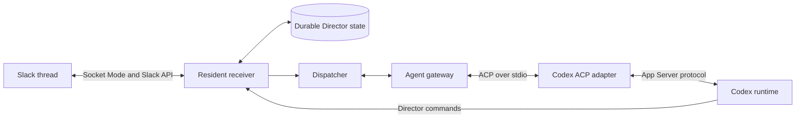

# Agent gateway and ACP migration

Director keeps transport and accountability local. Slack Socket Mode delivers events to the resident receiver; SQLite stores source revisions, jobs, responsibilities, reminders and outgoing keys. The dispatcher calls an agent gateway. For Codex, the gateway uses the official Python ACP SDK for protocol models, transport and request correlation; it owns runtime sessions and translates SDK events; it does not decide whether a Slack answer was delivered.



## Scope

This change implements proposal items 1, 3 and 6: a runtime boundary, durable conversation bindings and a reviewed migration with rollback controls. A named profile chooses the backend today. Future task routing can select a profile when creating a conversation; an existing conversation retains its recorded backend/profile/session. The original ACP migration retained fixed Codex selection. The opt-in [complexity selection extension](model-selection.md) adds a LiteLLM selector and an official Claude one-shot backend while preserving these session and publication boundaries.

ACP gives Director a resident bidirectional connection with session updates and cancellation. It does not remove the receiver's deterministic maintenance ticks, reminder timers or Slack catch-up. These do not invoke a model while idle. The retired Codex relay/manager schedules remain paused.

## Runtime and state

Install Python dependencies with `.venv/bin/python -m pip install -r requirements.txt`, including the pinned official `agent-client-protocol==0.12.1` SDK. Director must not implement its own ACP framing or JSON-RPC dispatcher. Install the checked-in Node dependency lock with `npm ci --no-audit --no-fund`. The root package pins both `@agentclientprotocol/codex-acp` 1.11.0 and `@openai/codex` 0.154.0. The ACP adapter resolves its bundled Codex App Server from this root package; before a controlled restart, verify that resolved path reports `codex-cli 0.154.0`. The separately configured `state/codex-runtime` executable remains the legacy CLI runtime during migration. Existing Codex authentication is reused; no credential copy or new API key is required. The adapter itself starts Codex App Server.

Each channel has its own backend gateways, state directory and DIRECTOR_CONFIG. Slack credentials remain in the receiver. With complexity selection disabled, retain the configured fixed Codex model and effort. Codex automatic approval review remains enabled; the Claude extension uses its configured auto permission mode. Do not replace approval review with full access to make a capability test pass.

The gateway records Slack root, profile, backend and session in `agent_sessions` alongside the existing dispatch jobs. Sessions are loaded after an adapter restart. Old CLI session identifiers are migration candidates: a successful ACP load must precede recording their binding. A failed load cannot silently create a fresh conversation.

A terminal ACP event is not a delivery receipt. Source jobs still require the completed source revision and the original `dispatch-answer:<job key>` outbox entry with a verified Slack timestamp. Preserve the same outgoing key during reconciliation. Uncertain interrupted turns must be fenced until their original work is reconciled; never automatically switch them to another backend or replay side effects.

## Controlled activation

1. Run the Python test suite and `python3 scripts/acceptance.py validate`. Review the immutable candidate, push its branch and merge through a PR.
2. Install the pinned dependencies in the published receiver checkout. Confirm the runtime command exists before restarting.
3. Record the published SHA and both-channel idle state. The shared resident receiver hosts the personal and test environments: do not start a second Socket Mode receiver.
4. Enable the ACP configuration for the test channel first. Use the explicit legacy-session migration setting for the prepared old conversation. Follow acceptance/RUNNER.md and record the actual Slack results, durable bindings and runtime settings under ignored state/acceptance/.
5. Verify A20–A23 plus the existing dispatcher, cards, reminders and recovery expectations. Activate the personal channel only after the test environment demonstrates preserved capabilities. Keep incomplete cases visible; unit tests do not establish UI acceptance.

## Fast reply workflow

The receiver acknowledges validated durable intake directly, with a target of two seconds under healthy Slack transport conditions. The agent does not control this received checkmark. Separate source-read/preparation and completion records retain their original meaning.

Before inference, the dispatcher prepares verified source evidence, relevant bounded thread context and compact runtime instructions. The agent receives known tool definitions through an official-SDK MCP server attached to ACP sessions. Ordinary questions should proceed directly to the answer rather than rereading runtime documents, searching memory, discovering CLI syntax or refetching the supplied source.

The explicit `publish_reply` tool carries the prepared turn authority and answer text to the resident receiver. The receiver owns original-thread routing, current source/job authority checks, responsibility fences where applicable, stable outbox delivery/reconciliation, and completion after verified delivery. It does not interpret an ACP terminal event as delivery, publish internal reasoning, or replay uncertain side effects. No credentials are placed in MCP arguments or copied from the receiver. The MCP server keeps a stable channel configuration across session loads; each invocation carries its explicit turn authority for receiver validation. This avoids relying on replacement of cached MCP process arguments. Existing session load/new behavior and channel separation remain required.

A24 verifies received-checkmark timing and independence from model preparation. A25 verifies the actual MCP tool call, absence of routine startup/answer-file operations, and the unchanged publication/revision/fence protections. Existing tests continue to cover task cards, continuations, reminders and recovery.

## Rollback and recovery

Retain the legacy executable and its configuration during migration. A configuration rollback is safe only when the receiver is idle and no ACP turn is unresolved. ACP-bound conversations must not resume a stale legacy identifier or start without their ACP history. Keep bindings and jobs intact and reconcile their verified delivery/receipts before any deliberate runtime transfer. Do not delete state to clear an error. An unbound conversation that failed before ACP preparation completed can retry through the legacy runtime after an explicit configuration rollback; its new attempt must carry legacy ownership, with prior ACP attempt metadata cleared.

For a blocked test job, use the receiver-owned command with the exact durable job key:

```sh
.venv/bin/python -m director --config config/director-tests.json dispatch-reconcile --key JOB_KEY
```

The command checks the source revision, completion receipt, original outbox entry and runtime ownership. It cannot release a live uncertain turn. To explicitly request a retry after the original turn has stopped, add `--retry-if-stopped`; the receiver requires a matching terminal acknowledgement or independent proof that the recorded process group is gone before releasing the job. The original conversation binding and outgoing key are preserved. A missing or still-live runtime identity without a matching terminal acknowledgement leaves the job blocked. A rollback fence created before any prompt was sent can resume after the ACP configuration is restored; it has no old turn to stop. Do not substitute a new source or delete a binding to bypass recovery.

ACP cancellation is a notification: successful transmission alone is not proof that the turn stopped. A normal prompt error response and a cancellation confirmed by the final prompt response are scoped to their own turn; they do not require restarting healthy conversations. If ownership remains unresolved and no terminal acknowledgement arrives, first let unrelated turns settle, verify both channels are idle apart from the blocked work, and use the documented controlled receiver restart. Then retry reconciliation and verify the returned outcome plus the job state. A connected receiver alone is not proof that the old process group has stopped.

The restart helper has one maintenance-only exception for a spent Guardian retry. It accepts no other active work: across both dispatch stores there must be exactly one `blocked` `guardian_approved_retry_unpublished` job with `runtime='acp'` and a non-null `finished_at`, one `used` approval, one or more associated publish authorities all `closed`, no pending/submitting/uncertain approval, and a valid owned recorded process group. It preserves every database fence. Only after bootout and confirmed service absence does it make a no-signal process-group probe; only `ProcessLookupError` proves release. Any live, permission, or invalid result reports `spent_guardian_runtime_unresolved`, skips normal bootstrap, and restores the service after a fresh absence check. This exception never settles the job, retries its old action, or repeats native approval.

## One-use Guardian approval for a denied source reply

Director keeps Codex automatic review enabled. When the pinned adapter reports a completed, denied `publish_reply` review for the current source authority, the receiver fences that reply and records a local job key, Slack root, expiry, opaque review ID, fingerprint, payload digest, and the exact reply-display fields in owner-private local state. It never stores or accepts a Guardian event from the caller. The adapter retains the native event in memory and uses Codex's supported `thread/approveGuardianDeniedAction` route.

The feed projects a terminal pending source reply into its existing Card-B row. The complete exact proposed reply is rendered as plain text; the owner-bound **Approve once** action holds only a random feed token. Socket Mode acknowledges it immediately and the listener validates owner, team, and feed channel; the receiver loop revalidates current card generation, source, and pending record before it invokes the same native route. Oversized proposals have no Slack approval button, so authenticated local review remains available.

The owner can also list pending records through the authenticated local receiver. This output intentionally contains no reply body, authority, fingerprint, or review event:

```sh
.venv/bin/python -m director --config config/director-tests.json guardian-pending
```

For exactly one selected key, the owner can then request the native approval:

```sh
.venv/bin/python -m director --config config/director-tests.json guardian-approve --key JOB_KEY
```

The receiver rechecks the source revision, root, session and runtime generation; the approved normal turn must publish the same authority and exact payload digest. A second command, changed payload, source change, adapter/receiver restart, or expiry fails closed. The approval grants one retry only. A retry that ends without verified delivery remains blocked and is never placed on the ordinary automatic retry path. A Slack approval row is available only for a complete, current, owner-bound pending proposal; it never accepts a native event, authority, review ID, or text from Slack.

If runtime startup, capability negotiation or session loading fails, inspect the job error and private ACP stderr for that environment. Restore the receiver service after any controlled stop and verify connected health. Never clear a blocked root solely because the receiver is connected.

## Evidence

A20 tests separate conversations and continuity; A21 exercises the actual CLI-to-ACP migration and restart; A22 injects gateway faults in isolated state; A23 executes file and browser tools through the selected runtime and checks model/reasoning/approval parity; A29 exercises one fresh controlled denial, one local native approval, and exactly one verified source reply. Existing A01–A19 remain required according to the change-routing table. The real Later timer in A04 must elapse normally and cannot be substituted with a shortened fixture timer.

## Library and adapter verification

The [official Python SDK](https://agentclientprotocol.com/libraries/python) owns the ACP wire protocol. The [Codex adapter](https://github.com/agentclientprotocol/codex-acp) owns the translation to Codex App Server. Director owns the surrounding job and session lifecycle.

In the pinned adapter 1.11.0 distribution, `startAcpServer` parses the `CODEX_CONFIG` environment variable and `getInitialAgentMode` reads `INITIAL_AGENT_MODE`. Its `agent` mode supplies `on-request`, `auto_review` and `workspaceWrite` to each Codex turn. These settings are an adapter interface, not environment variables invented by Director. Effective session settings must also be observed in runtime diagnostics.

Verify adapter, tool, session-resume, and approval compatibility on the destination runtime using the acceptance runner. A dependency pin does not establish live compatibility.

The reply tool uses the official MCP SDK low-level Server and stdio transport. It does not use dotenv-based server settings: the deployed checkout may contain a credential pipe named `.env`, and reply-tool startup must never open it.
